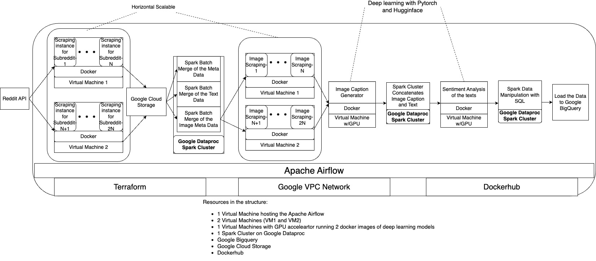
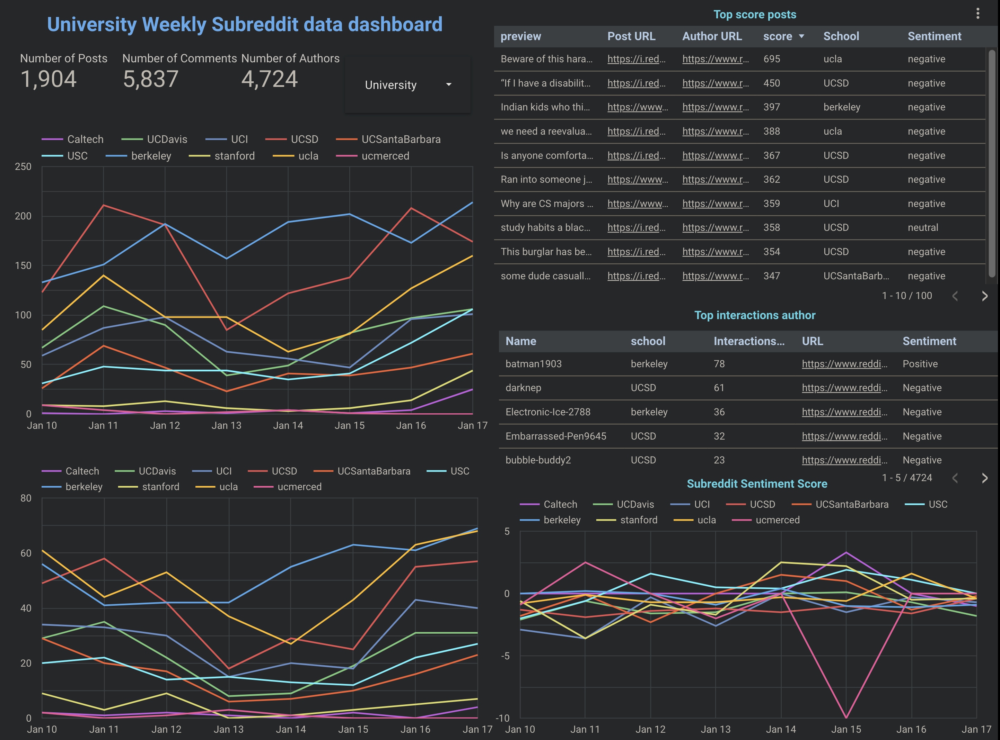
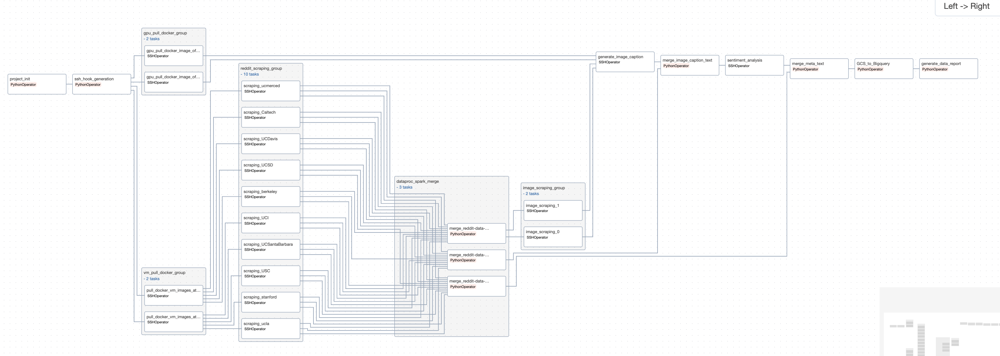

# University Reddit Data Dashboard

The University Reddit Data Dashboard provides a comprehensive view of key statistics from the university's subreddit, encompassing both posts and comments over the past week. It features an in-depth analysis of sentiments expressed in these posts, comments, and by the authors themselves, all tracked and evaluated over the same seven-day period.

## Features

The project is entirely hosted on the Google Cloud Platform and is ***horizontal scalable***. The scraping workload is evenly distributed across the computer engines(VM). Data manipulation is done through the Spark cluster(Google dataproc), where by increasing the worker node, the workload will be distributed across and finished more quickly.

## Project Structure



## Examples

The following [dashboard](https://lookerstudio.google.com/reporting/97414aef-54dc-4fc8-8bf5-054f0ac75d2c) is generated with following parameters: 1 VM for airflow, 2 VMs for scraping, 1 VM with Nvidia-T4 GPU, Spark cluster(2 worker node 1 manager node), 10 universities in California.

### Example Dashboard



### Example DAG




## Tools

1. Python
   1. PyTorch
   2. Google Cloud Client Library
   3. Huggingface
2. Spark(*Data manipulation*)
3. Apache Airflow(*Data orchestration*)
   1. Dynamic DAG generation
   2. Xcom
   3. Variables
   4. TaskGroup
4. Google Cloud Platform
   1. Computer Engine(*VM & Deep learning*)
   2. Dataproc (*Spark*)
   3. Bigquery (*SQL*)
   4. Cloud Storage (*Data Storage*)
   5. Looker Studio (*Data visualization*)
   6. VPC Network and Firewall Rules
5. Terraform(*Cloud Infrastructure Management*)
6. Docker(*containerization*) and Dockerhub(*Distribute container images*)
7. SQL(*Data Manipulation*)
8. Makefile

## Preparation

### Install VScode and Remote Development Extension

Use VSCode to SSH to the remote server to run apache airflow

### Google Cloud Platform

#### Get the project id: Google Project Initialization

At [Google Cloud Platform](https://console.cloud.google.com/), Create the Project and record the **project_id**

#### Get Service Account key: Google Service Account Requirement

* Create the Google Service Account at [GCP IAM](https://console.cloud.google.com/iam-admin/serviceaccounts)
* Make sure the Google Service Account you use is the `owner` and is `storage admin`. You can add/change the service account [here](https://console.cloud.google.com/iam-admin/iam)
* Generate Google Service Account key in this link: [Service Account](https://console.cloud.google.com/iam-admin/serviceaccounts/) and **store** the json key as `gcp_key.json` on local computer. You will be prompted to enter the GCP key file path

#### Enable Google API Requirement

1. [Identity Access Management API](https://console.cloud.google.com/apis/api/iam.googleapis.com)
2. [Google Compute Engine API](https://console.cloud.google.com/apis/api/compute.googleapis.com)
3. [Google Dataproc API](https://console.cloud.google.com/apis/api/dataproc.googleapis.com)

#### Change Google Quotas

You may need to request quota change [here](https://console.cloud.google.com/iam-admin/quotas).

* Resources quotas
  * GPU: T4 By Default at US-Central-1
  * CPU scores depends on number of the VMs initialized

### Dockerhub private repository creation

* At [Dockerhub](https://hub.docker.com/), Create the following **private** repository:
  * `reddit-airflow`
  * `scrape-reddit`
  * `scrape-image`
  * `reddit-image-caption`
  * `reddit-sentiment-analysis`
* Make sure those repositoreis are private. You may need to pay for the private repositories in dockerhub

### Reddit Client API keys creation

* At [Reddit App](https://www.reddit.com/prefs/apps), create the application
* Each virtual machine needs a reddit client, so if there are two virtual machines for scraping, then you need to use two reddit account to create two applications respectively.
* Record the reddit client into a json file with the following format. You will be prompted to input the reddit client file path.

```json
{
    "client_id": ["client_id1", "client_id2"],
    "client_secret": ["client_secret1", "client_secret2"]
}
```

## Installation

### Warning: Due to GPU shortage, the gpu accelerator may not be available in certain regions. Terraform may fail to initialize computing resources.

### Warning: Docker builds may take some time because the size of deep learning images are large

### Warning: the scraping can take hours to run because of rate limit of reddit api

### Install the Local Python Dependencies

`pip3 install -r python_requirements.txt`

### Environment Variable Generation

You may need to pay for the dockerhub and GCP for the resources.
The following environment variable is required and by running `python3 env_generator.py` the environment variable will be created automatically

* `docker_username` : dockerhub username
* `docker_password` : the dockerhub password
* `service_account_email` : service account email under the project
* `gcp_key_path` : the service account key generated 
* `gcp_project_id` : the project id in the prepation
* `reddit_credential` : the reddit credential json file path
* `ssh_directory` : the **directory** to store the SSH Private and Public Key Pair
* `n_vms` : the number of virtual machines
* `n_worknodes` : the number of work nodes in the spark cluster
* `subreddits` : the subreddits seperated by space

### Make the project 

1. In the terminal, run `make reddit-data-dashboard` and follow the prompt
2. At the end, make will return strings having the following format 

```bash
--------------------SSH and SSH Remote Tunnel Command-----------------------
ssh -v -i path  airflow@12.34.56.78
ssh -v -i path -L 8080:localhost:8080 airflow@12.34.56.78
```

3. Use the first SSH command to get to `airflow@ip_address`
   1. At the remote server `cd airflows && sudo docker compose up`
   2. Wait the docker compose to finish
4. Run the second SSH command at another local machine terminal to connect to remote localhost:8080
5. At the brower, enter `localhost:8080`. The username is `airflow` and password is `airflow`
6. Go to [Variable](http://localhost:8080/variable/list/) page, and import the `variables.json` at airflows folder
7. Go to [DAG](http://localhost:8080/dags/university-subreddit-data-dashboard/grid) and Run the DAG

### Tear Down the project 

Run `make clean` and follow the prompt

## Future Direction

* Deploy the Airflow and Virtual Machines in K8s
* Train the deep learning model with the reddit dataset and distributed those models to the cloud

## Misc

### File Structure

```bash
.
├── Makefile
├── README.md
├── README_resources
│   ├── example_dag.png
│   ├── project_structure.jpg
│   └── university_subreddit_data_dashboard.png
├── airflows
│   ├── dags
│   │   └── university_subreddit_dag.py
│   ├── docker-compose.yaml
│   └── scripts
│       └── etl
│           ├── dataproc_merge_files.py
│           ├── dataproc_merge_two_files.py
│           ├── dataproc_merge_two_files_submit.py
│           ├── dataproc_single_directory.py
│           ├── gcs_to_bigquery.py
│           ├── generate_data_for_report.py
│           ├── proj_init.py
│           └── sql_queries
│               ├── basic_statistics.sql
│               ├── comments_breakdown.sql
│               ├── post_breakdown.sql
│               ├── sentiment_score.sql
│               ├── top_author.sql
│               └── top_score_posts.sql
├── env_generator.py
├── make_variables.py
├── python_requirements.txt
├── services
│   ├── airflow_image
│   │   ├── Dockerfile
│   │   └── python_requirements.txt
│   ├── image_caption_docker
│   │   ├── Dockerfile
│   │   ├── image_caption.py
│   │   └── python_requirements.txt
│   ├── image_scrape_docker
│   │   ├── Dockerfile
│   │   ├── image_scraping.py
│   │   └── python_requirements.txt
│   ├── scrape_docker
│   │   ├── Dockerfile
│   │   ├── reddit_scraping.py
│   │   └── requirements.txt
│   └── sentiment_analysis_docker
│       ├── Dockerfile
│       ├── python_requirements.txt
│       └── sentiment_analysis.py
├── ssh_command.py
└── terraform
    ├── main.tf
    ├── output.tf
    └── variables.tf
```